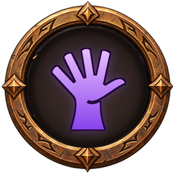
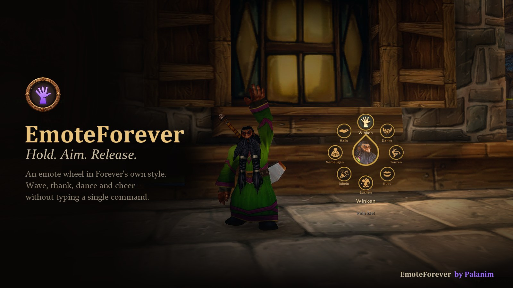
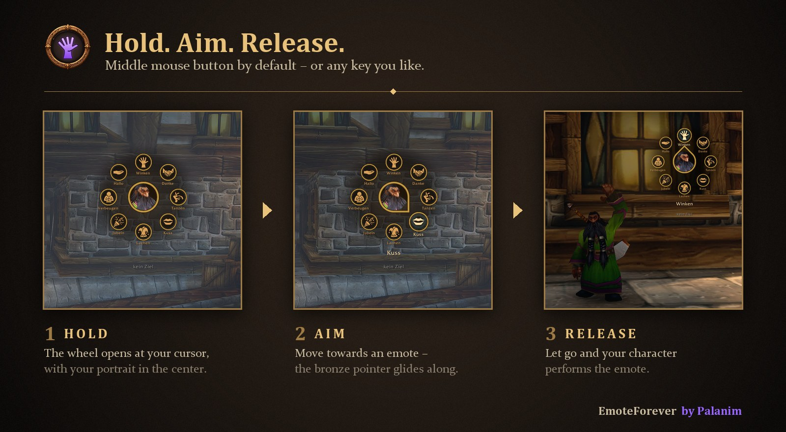
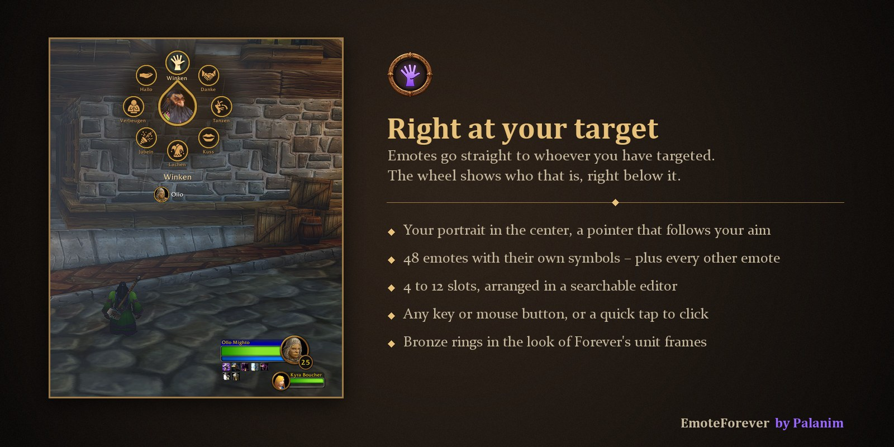

# EmoteForever

**An emote wheel for World of Warcraft: Forever.**
Hold a key, flick the mouse towards an emote, release – your character waves, thanks, dances or cheers at your target.

by **Palanim**

## Highlights

- **Hold, aim, release** – the wheel opens right at your cursor
- **Right at your target** – the wheel shows who your emote goes to
- **48 emotes with their own symbols** – plus every other emote of the game
- **Your own wheel** – 4 to 12 slots, arranged in a searchable editor
- **Any key** – middle mouse button by default, or any key or mouse button you like
- **Fits the game** – bronze rings like Forever's unit frames, your portrait in the center
- English and German

## Features

### Hold. Aim. Release.

Hold the middle mouse button and the wheel opens at your cursor, with your portrait in the center. Move towards an emote – a bronze pointer glides along – and let go. Prefer clicking? Tap the key briefly and the wheel stays open until you choose.

### Right at your target

Emotes go straight to whoever you have targeted. The wheel shows their name and portrait right below it, so you always know who gets the wave.

### Your own wheel

Choose 4 to 12 slots and put any emote on any slot: click a slot, then pick from a searchable list of every emote in the game. <kbd>Shift</kbd>-click an emote to try it out first. New slots start with popular emotes.

### Minimap button

Left-click opens the settings, right-click opens the wheel. Don't like minimap buttons? Turn it off in the settings.

## Usage

| Action | Effect |
|---|---|
| Hold your key, aim, release | Perform an emote |
| Tap your key | Keep the wheel open, choose with a click |
| `/emf` | Open settings |
| `/emf edit` | Arrange the wheel |

## FAQ

**My middle mouse button is already in use?**
EmoteForever tells you and lets you pick another key in the settings (`/emf`).

**Can I use emotes that are not in the list of 48?**
Yes – every emote of the game can go on the wheel; emotes without their own symbol get a neutral one.

## Feedback

Found a bug or have an idea? Please [open an issue](https://github.com/palanimForever/EmoteForever/issues).

## Credits

The emote symbols are from [game-icons.net](https://game-icons.net), licensed under [CC BY 3.0](https://creativecommons.org/licenses/by/3.0/). They were recolored to plain white for tinting in-game.

- Caro Asercion: round-potion
- DarkZaitzev: acrobatic
- Delapouite: biceps, brick-wall, card-joker, chat-bubble, chicken, crosshair, exit-door, health-potion, jester-hat, kneeling, knight-banner, lovers, night-sleep, party-popper, person, present, shaking-hands, steam-locomotive, thumb-down, thumb-up, tongue, two-coins
- Lorc: beer-stein, cannon, chicken-leg, drama-masks, footprint, high-five, hood, hourglass, hunting-horn, laurel-crown, lion, lips, meditation, palm, pointing, prayer, ringing-bell, rose, run, shouting, tear-tracks, wolf-head
- Sbed: help
- Skoll: fist, open-palm, talk

EmoteForever embeds [LibStub](https://www.wowace.com/projects/libstub), [CallbackHandler-1.0](https://www.wowace.com/projects/callbackhandler), [LibDataBroker-1.1](https://github.com/tekkub/libdatabroker-1-1) and [LibDBIcon-1.0](https://www.curseforge.com/wow/addons/libdbicon-1-0) for the minimap button.

## License

MIT – see [LICENSE](LICENSE). Embedded libraries and the emote symbols keep their own licenses.
